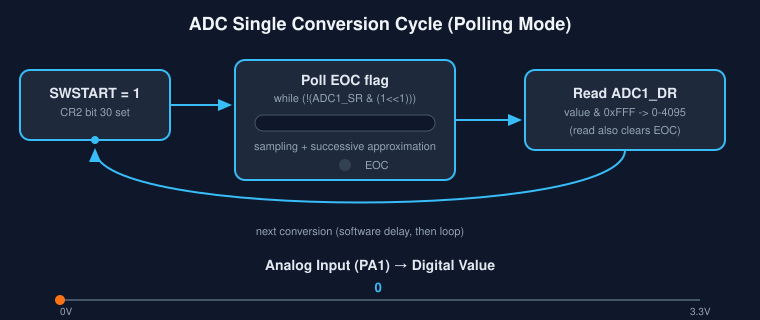

# STM32F4 Bare-Metal ADC Polling Example

A minimal, register-level (no HAL, no CMSIS abstraction) example that configures **ADC1 Channel 1** on **PA1** in single-conversion, polling mode, and continuously prints the resulting 12-bit digital value over the debug console (ITM/SWO via `printf`).

This is written using **direct memory-mapped register access** so every bit that gets touched is visible and explained.

---

## 🎞️ Animated Overview



The animation shows the three-stage loop this code repeats forever: **start conversion → poll EOC flag while the ADC samples internally → read the result register**, then loop back and do it again. The moving dot along the bottom axis represents the analog voltage on PA1 sweeping from 0V to 3.3V, and how that continuously maps to a 0–4095 digital value.

> GitHub renders `.svg` files natively as images, including any embedded SMIL animation, so this should animate directly in the rendered README.

---

## 🔧 Hardware Assumptions

| Item | Value |
|---|---|
| MCU | STM32F4 series (e.g. STM32F407) |
| Analog input pin | **PA1** |
| Peripheral | **ADC1**, regular channel 1 |
| Resolution | 12-bit (0–4095) |
| Conversion mode | Single conversion, software-triggered, polling (no interrupts/DMA) |
| Output | `printf` over debug console (semihosting/ITM — needs to be wired up separately) |

---

## 📜 Full Code

```c
#include <stdint.h>
#include <stdio.h>

#define RCC_AHB1ENR  *((volatile uint32_t*)0x40023830)
#define RCC_APB2ENR  *((volatile uint32_t*)0x40023844)
#define GPIOA_MODER  *((volatile uint32_t*)0x40020000)
#define ADC1_SR      *((volatile uint32_t*)0x40012000)
#define ADC1_CR1     *((volatile uint32_t*)0x40012004)
#define ADC1_CR2     *((volatile uint32_t*)0x40012008)
#define ADC1_SQR3    *((volatile uint32_t*)0x40012034)
#define ADC1_DR      *((volatile uint32_t*)0x4001204C)
```

---

## 🧩 Line-by-Line Explanation

### Register Definitions

```c
#define RCC_AHB1ENR  *((volatile uint32_t*)0x40023830)
```
Maps the name `RCC_AHB1ENR` onto a fixed memory address — the **RCC AHB1 peripheral clock enable register**. GPIO ports (A, B, C…) live on the AHB1 bus, so their clock gating bits are here. `volatile` prevents the compiler from caching or optimizing away accesses, since this "variable" is really hardware state.

```c
#define RCC_APB2ENR  *((volatile uint32_t*)0x40023844)
```
The **APB2 peripheral clock enable register**. ADC1 lives on the APB2 bus, so its clock-enable bit is found here (a different register from the timer example, which used APB1).

```c
#define GPIOA_MODER  *((volatile uint32_t*)0x40020000)
```
**GPIOA mode register** — same structure as GPIOD's `MODER` in the PWM example: 2 bits per pin selecting Input / Output / Alternate Function / **Analog**.

```c
#define ADC1_SR      *((volatile uint32_t*)0x40012000)
```
**ADC1 Status Register** — flags indicating conversion state, most importantly the **EOC** (End Of Conversion) bit (bit 1) that tells software "the result is ready."

```c
#define ADC1_CR1     *((volatile uint32_t*)0x40012004)
```
**Control Register 1** — configures resolution, interrupt enables, scan mode, etc. (Not modified in this example — the ADC's power-on defaults of 12-bit resolution and single-conversion behavior are used as-is.)

```c
#define ADC1_CR2     *((volatile uint32_t*)0x40012008)
```
**Control Register 2** — controls conversion triggering, continuous vs. single mode, data alignment, and crucially the **ADON** (ADC ON) and **SWSTART** (software start) bits used below.

```c
#define ADC1_SQR3    *((volatile uint32_t*)0x40012034)
```
**Regular Sequence Register 3** — for a scan of up to 16 channels, this register holds the **channel numbers** for conversions 1–6 in the sequence (5 bits per slot). Since this example only converts one channel, only the first 5-bit field (bits 0–4) matters.

```c
#define ADC1_DR      *((volatile uint32_t*)0x4001204C)
```
**Data Register** — holds the completed conversion result (12 bits, right- or left-aligned depending on `CR2` config; default is right-aligned). Reading this register also automatically clears the EOC flag in hardware.

---

### `init_adc()` — One-Time Setup

#### Step 1 — Enable Clocks

```c
RCC_AHB1ENR |= (1 << 0);  // GPIOA Clock
```
Sets bit 0 of `RCC_AHB1ENR`, the **GPIOA enable bit**, powering on GPIO port A's logic so writes to `GPIOA_MODER` take effect.

```c
RCC_APB2ENR |= (1 << 8);  // ADC1 Clock
```
Sets bit 8 of `RCC_APB2ENR`, the **ADC1 enable bit**, supplying a clock to the ADC peripheral. Without this, the ADC registers exist in the address space but the peripheral itself is inert.

#### Step 2 — Configure PA1 for Analog Mode

```c
GPIOA_MODER |= (3 << 2);
```
Pin 1 occupies bits 2–3 in `MODER` (`pin_number * 2`). Writing `3` (binary `11`) into those bits selects **Analog mode** — the mode required for a pin to be used as an ADC input. Unlike the PWM example's Alternate Function mode, analog mode fully disconnects the pin's digital input/output buffers to avoid noise and leakage on the analog signal. (Note: this line only *sets* bits with `|=`; it doesn't clear them first the way the PWM example did. Since binary `11` sets both bits regardless of their previous state, the result is correct here regardless — but it's worth noting the mask-then-set pattern was skipped since `11` is the "all bits set" case.)

#### Step 3 — Configure the ADC Channel Sequence

```c
ADC1_SQR3 = 1;
```
Writes `1` into the first slot of the regular conversion sequence, telling the ADC "the *only* channel to convert is **channel 1**" (which corresponds to pin PA1 on this MCU family — ADC channel numbering matches pin numbering for PA0–PA7). The sequence *length* field lives in `SQR1` and defaults to 0 after reset, meaning "1 conversion," which matches what's wanted here, so `SQR1` isn't touched.

#### Step 4 — Power On the ADC

```c
ADC1_CR2 |= (1 << 0);     // ADON bit
```
Sets bit 0 of `CR2`, the **ADON** bit, which powers up the ADC's analog circuitry. On real hardware there's a short stabilization time needed after this before the first conversion is reliable — this example doesn't add an explicit delay for that, so the very first reading could be slightly off on some parts.

---

### `read_adc()` — Perform One Conversion

```c
ADC1_CR2 |= (1 << 30);
```
Sets bit 30 of `CR2`, the **SWSTART** bit, which manually triggers a new conversion (since no external hardware trigger is configured). This is the software equivalent of a "go" pulse.

```c
while (!(ADC1_SR & (1 << 1))) {}
```
**Polls** bit 1 of the status register, the **EOC** (End Of Conversion) flag, in a tight spin loop. `ADC1_SR & (1<<1)` isolates that bit; `!(...)` inverts it so the loop keeps spinning *while the bit is still 0* (conversion still in progress) and only exits once hardware sets it to 1. This is a blocking wait — the CPU does nothing else while the ADC samples and converts (a successive-approximation process that takes a fixed number of ADC clock cycles).

```c
return (uint16_t)(ADC1_DR & 0xFFF);
```
Reads the **Data Register** and masks with `0xFFF` (12 ones) to keep only the 12 valid result bits, discarding any unrelated upper bits. The read from `ADC1_DR` also **automatically clears EOC** in hardware, resetting the flag for the next conversion. The result is cast to `uint16_t` since a 12-bit value (0–4095) comfortably fits in 16 bits.

---

### `main()`

```c
int main(void) {
    init_adc();
    uint16_t sensor_value = 0;
```
Runs the one-time setup (clocks, pin mode, sequence, power-on), and declares a variable to hold each reading.

```c
    while(1) {
        sensor_value = read_adc();
        printf("ADC Value: %u\n", sensor_value);
```
Infinite loop: each iteration triggers a fresh conversion (`read_adc()` handles start → poll → read internally) and prints the resulting 0–4095 value. `%u` is used since the value is unsigned.

```c
        for(volatile int i = 0; i < 500000; i++);
```
A crude busy-wait delay between prints. The comment in the original code explains the reasoning well: without *some* delay, the loop would attempt to print potentially hundreds of thousands of times per second, which can overwhelm or crash a debugger's console output pipe (ITM/SWO has limited bandwidth). `volatile` prevents the compiler from optimizing the empty loop away.

```c
        // You now have a value from 0 to 4095 representing the voltage
    }
}
```
Closes the loop — this repeats forever, continuously sampling PA1 and reporting its value. Since ADC resolution is 12-bit and (assuming default 3.3V reference) the mapping is linear: `voltage ≈ (sensor_value / 4095) * 3.3V`.

---

## 📊 How the Value Maps to Voltage

| ADC Value | Approx. Voltage (Vref = 3.3V) |
|---|---|
| 0 | 0.0 V |
| 1024 | ~0.825 V |
| 2048 | ~1.65 V |
| 3072 | ~2.475 V |
| 4095 | ~3.3 V |

---

## ⚠️ Known Caveats / Things to Verify

- **No ADON stabilization delay**: Real hardware datasheets typically recommend a short delay (a few microseconds) between setting `ADON` and starting the first conversion, to let the internal reference/bandgap stabilize. This example omits it.
- **`printf` needs retargeting**: On bare-metal, `printf` doesn't work out of the box — it requires a `_write`/semihosting or ITM (SWO) backend to actually route characters somewhere visible. That plumbing isn't shown here.
- **Data alignment**: The `0xFFF` mask assumes default **right-aligned** data in `CR2` (the reset default). If alignment were changed to left-aligned, the mask/shift would need to change too.
- **Single-conversion mode assumed**: `CR2`'s `CONT` (continuous mode) bit is left at its reset value of 0, meaning each `SWSTART` performs exactly one conversion — matching this polling-driven, one-shot-per-loop usage pattern.

---

## 📄 License

Feel free to use, modify, and adapt this example for learning or personal/commercial projects.
